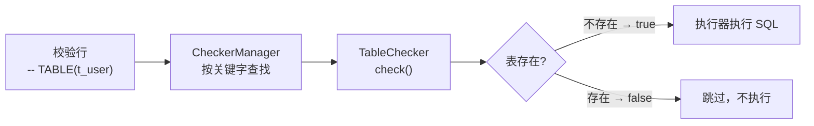

import Tabs from '@theme/Tabs';
import TabItem from '@theme/TabItem';

# 校验器

校验器（`EzasseChecker`）是 ezasse 中负责**决定某段 SQL 脚本是否需要被执行**的核心组件。每一条校验行（如 `-- TABLE(user)`）都会映射到一个对应的校验器，由它查询数据源的当前状态，并返回 `true`（需要执行）或 `false`（跳过）。

## 工作原理



## 内置校验器

`ezasse-for-jdbc` 模块提供以下开箱即用的校验器：

| 校验器类 | 关键字（默认） | 参数格式 | 作用 |
|---|---|---|---|
| `TableChecker` | `TABLE` | `(表名)` | 表不存在时返回 `true` |
| `AddFieldChecker` | `ADD` | `(表名.列名)` | 列不存在时返回 `true` |
| `ExecChecker` | `EXEC` | `(SQL语句)` | SQL 返回值为 0 时返回 `true` |
| `ChangeNameChecker` | `CHANGE_NAME` | `(表名.新列名)` | 新列名不存在时返回 `true` |
| `ChangeTypeChecker` | `CHANGE_TYPE` | `(表名.列名.目标类型)` | 类型不匹配时返回 `true` |
| `ChangeLengthChecker` | `CHANGE_LENGTH` | `(表名.列名.目标长度)` | 长度不匹配时返回 `true` |
| `ChangeCommentChecker` | `CHANGE_COMMENT` | `(表名.列名.目标注释)` | 注释不匹配时返回 `true` |

## EzasseChecker 接口说明

所有校验器都继承自抽象类 `cn.com.pism.ezasse.checker.EzasseChecker`：

```java
public abstract class EzasseChecker {

    /**
     * 执行校验逻辑（核心方法，子类必须覆盖）
     *
     * @param dataSource   当前校验使用的数据源
     * @param checkContent 校验行括号内的内容，如 TABLE(user) 中的 "user"
     * @return true 代表条件满足（需要执行后续 SQL）；false 代表跳过
     */
    public boolean check(EzasseDataSource dataSource, String checkContent) { ... }

    /**
     * 返回该校验器对应的关键字 ID（与 SQL 中的关键字一一对应）
     * 例如：return "TABLE"; 对应 -- TABLE(...)
     */
    public abstract String getId();

    /**
     * 是否允许校验内容为空，默认 false
     * 若返回 true，括号内容为空时也会触发执行
     */
    public boolean allowEmpty() {
        return false;
    }

    /**
     * 通过数据源获取对应的执行器（子类可直接使用）
     */
    protected EzasseExecutor getEzasseExecutor(EzasseDataSource dataSource) { ... }
}
```

## 自定义校验器（完整流程）

以下以"检测存储过程是否存在"为例，展示完整的自定义校验器开发流程。

### 第一步：实现校验器

```java
package com.example.ezasse.checker;

import cn.com.pism.ezasse.checker.EzasseChecker;
import cn.com.pism.ezasse.model.EzasseDataSource;
import cn.com.pism.ezasse.model.EzasseExecutor;
import org.springframework.jdbc.core.JdbcTemplate;

import javax.sql.DataSource;

/**
 * 自定义校验器：检测数据库中是否存在指定存储过程
 * 使用关键字：PROCEDURE
 * 使用示例：-- PROCEDURE(proc_hello)
 */
public class ProcedureChecker extends EzasseChecker {

    @Override
    public boolean check(EzasseDataSource dataSource, String checkContent) {
        // 从数据源获取底层 DataSource
        DataSource ds = dataSource.getDataSource();
        JdbcTemplate jdbcTemplate = new JdbcTemplate(ds);

        // checkContent 即括号内的值，此例中为存储过程名
        String sql = "SELECT COUNT(1) FROM information_schema.ROUTINES " +
                     "WHERE ROUTINE_TYPE = 'PROCEDURE' AND ROUTINE_NAME = ?";
        Integer count = jdbcTemplate.queryForObject(sql, Integer.class, checkContent);

        // 存储过程不存在 → 返回 true（触发执行）
        // 存储过程已存在 → 返回 false（跳过）
        return count == null || count == 0;
    }

    @Override
    public String getId() {
        // 对应 SQL 文件中的关键字：-- PROCEDURE(...)
        return "PROCEDURE";
    }
}
```

### 第二步：注册校验器

根据项目类型选择相应的注册方式：

<Tabs groupId="register-method">
  <TabItem value="spi" label="SPI（推荐，适用所有项目）">

在 `src/main/resources/META-INF/services/` 目录下创建文件：

**文件名：** `cn.com.pism.ezasse.checker.EzasseChecker`

**文件内容：**

```
com.example.ezasse.checker.ProcedureChecker
```

ezasse 启动时会通过 Java `ServiceLoader` 自动加载并注册所有列出的校验器。

  </TabItem>
  <TabItem value="spring" label="Spring Bean（适用 Spring Boot 项目）">

直接声明为 Spring Bean，ezasse 的自动装配会自动感知并注册：

```java
import org.springframework.context.annotation.Bean;
import org.springframework.context.annotation.Configuration;
import com.example.ezasse.checker.ProcedureChecker;

@Configuration
public class EzasseCheckerConfig {

    @Bean
    public ProcedureChecker procedureChecker() {
        return new ProcedureChecker();
    }
}
```

  </TabItem>
  <TabItem value="manual" label="手动注册（编程式）">

直接通过 `EzasseContext` 手动注册：

```java
import cn.com.pism.ezasse.FileEzasse;

FileEzasse ezasse = new FileEzasse();
// 手动注册自定义校验器
ezasse.getContext().checkerManager().registerChecker(new ProcedureChecker());
ezasse.execute();
```

  </TabItem>
</Tabs>

### 第三步：使用自定义校验行

注册完成后，即可在 SQL 文件中使用自定义关键字：

```sql title="src/main/resources/sql/v1.0.0-100-procedure.sql" showLineNumbers
-- 当存储过程 proc_hello 不存在时，创建它
-- PROCEDURE(proc_hello)
CREATE PROCEDURE proc_hello()
BEGIN
    SELECT 'Hello, ezasse!';
END;
```

## 高级用法

### 在校验器中使用执行器 Action

如果校验逻辑需要与执行器共用同一套 Action（如 `GET_TABLE_INFO`），可以直接通过父类的 `getEzasseExecutor()` 获取执行器，复用已注册的 Action 能力：

```java
@Override
public boolean check(EzasseDataSource dataSource, String checkContent) {
    EzasseExecutor executor = getEzasseExecutor(dataSource);

    // 通过已注册的 Action 获取表信息
    List<EzasseTableInfo> tableInfos = executor.execute(
        "GET_TABLE_INFO",
        GetTableInfoActionParam.builder().tableName(checkContent).build(),
        dataSource
    );
    return CollectionUtils.isEmpty(tableInfos);
}
```

### 允许空内容的校验器

某些场景下，校验行无需括号内的参数即可运行。覆盖 `allowEmpty()` 方法让 ezasse 不过滤该校验行：

```java
@Override
public boolean allowEmpty() {
    // 即使括号内为空，也允许触发校验
    return true;
}
```

用法示例：

```sql
-- 仅判断当前 schema 下是否没有任何表，有则跳过
-- SCHEMA_EMPTY()
CREATE TABLE init_flag (id INT PRIMARY KEY);
```

## 注意事项

:::caution
- `getId()` 返回值必须全局唯一。若多个校验器返回相同 ID，后注册的会覆盖先注册的。
- 若 SQL 文件中出现了未注册的关键字，该校验行及其对应的 SQL 块将被**静默忽略**，不会报错。开启 debug 日志可以看到跳过信息。
:::

:::tip
自定义关键字无需在配置文件中声明，只要校验器的 `getId()` 与 SQL 文件中的关键字一致即可生效。
:::