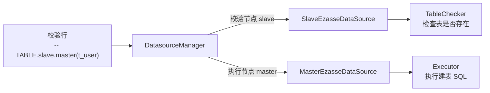

import Tabs from '@theme/Tabs';
import TabItem from '@theme/TabItem';

# 数据源

数据源（`EzasseDataSource`）是 ezasse 对底层连接的统一抽象。校验器和执行器在运行时都不直接持有数据库连接，而是通过数据源对象来获取。

在 Spring Boot 环境下，ezasse 会自动将 Spring 管理的 `DataSource` 包装为 `EzasseDataSource` 并注册为 **master** 节点，通常**无需手动配置**。

## 数据源在系统中的角色



## EzasseDataSource 接口说明

```java
public interface EzasseDataSource {

    /**
     * 获取底层数据源对象
     * JDBC 场景下返回 javax.sql.DataSource；自定义场景可返回任意对象
     */
    <T> T getDataSource();

    /**
     * 获取数据源节点 ID
     * 在校验行语法中通过该 ID 引用，如 -- TABLE.slave(t_user) 中的 "slave"
     */
    String getId();

    /**
     * 获取数据源类型
     * 用于与执行器匹配，如 "MYSQL"、"ORACLE"、"CLICKHOUSE"
     * 必须与对应执行器的 getDataSourceType() 返回值完全一致
     */
    String getType();
}
```

## 单数据源（默认场景）

标准 Spring Boot 项目中，只需正常配置 `spring.datasource`，ezasse 自动注册为 **master** 节点：

```yaml title="application.yml"
spring:
  datasource:
    url: jdbc:mysql://localhost:3306/mydb
    username: root
    password: your_password
```

此时 SQL 文件中所有不指定节点的校验行，均默认在 master 数据源上执行：

```sql
-- 在默认(master)数据源上检查表是否存在
-- TABLE(t_user)
CREATE TABLE t_user ( id BIGINT PRIMARY KEY );
```

## 多数据源配置

当项目存在多个数据库实例时，手动注册多个数据源即可在校验行中按节点名称引用。

### 配置示例

```yaml title="application.yml"
spring:
  datasource:
    # 主数据源（ezasse 自动注册为 master）
    url: jdbc:mysql://master-host:3306/mydb
    username: root
    password: master_pass
  # 从数据源（需要手动注册到 ezasse）
  datasource-slave:
    url: jdbc:mysql://slave-host:3306/mydb
    username: root
    password: slave_pass
```

### 手动注册数据源

<Tabs groupId="register-method">
  <TabItem value="spring" label="Spring Boot（推荐）">

```java
package com.example.ezasse.config;

import cn.com.pism.ezasse.context.EzasseContextHolder;
import cn.com.pism.ezasse.jdbc.register.JdbcEzasseDataSource;
import cn.com.pism.ezasse.manager.DatasourceManager;
import org.springframework.beans.factory.annotation.Qualifier;
import org.springframework.boot.context.event.ApplicationReadyEvent;
import org.springframework.context.ApplicationListener;
import org.springframework.context.annotation.Configuration;

import javax.sql.DataSource;

@Configuration
public class EzasseDatasourceConfig implements ApplicationListener<ApplicationReadyEvent> {

    private final DataSource slaveDataSource;

    // 注入从数据源（需要在 Spring 中单独声明该 DataSource Bean）
    public EzasseDatasourceConfig(@Qualifier("slaveDataSource") DataSource slaveDataSource) {
        this.slaveDataSource = slaveDataSource;
    }

    @Override
    public void onApplicationEvent(ApplicationReadyEvent event) {
        DatasourceManager manager = EzasseContextHolder.getContext().datasourceManager();
        // 注册从数据源（节点 ID 为 "slave"）
        // JdbcEzasseDataSource 会自动从 JDBC URL 识别数据库类型
        manager.registerDataSource(new JdbcEzasseDataSource(slaveDataSource, "slave"));
    }
}
```

  </TabItem>
  <TabItem value="manual" label="非 Spring 项目（编程式）">

```java
import cn.com.pism.ezasse.FileEzasse;
import cn.com.pism.ezasse.jdbc.register.JdbcEzasseDataSource;

// 构建数据源（例如使用 HikariCP）
HikariDataSource masterDs = new HikariDataSource();
masterDs.setJdbcUrl("jdbc:mysql://localhost:3306/mydb");

HikariDataSource slaveDs = new HikariDataSource();
slaveDs.setJdbcUrl("jdbc:mysql://slave-host:3306/mydb");

FileEzasse ezasse = new FileEzasse();
DatasourceManager manager = ezasse.getContext().datasourceManager();

// 注册主数据源（也可使用 registerMasterDataSource）
manager.registerMasterDataSource(new JdbcEzasseDataSource(masterDs, "master"));
// 注册从数据源
manager.registerDataSource(new JdbcEzasseDataSource(slaveDs, "slave"));

ezasse.execute();
```

  </TabItem>
</Tabs>

### 在 SQL 文件中使用多数据源节点

注册完成后，校验行中可以通过节点名称指定校验和执行的数据源：

```sql
-- 语法：-- 关键字[.校验节点][.执行节点](校验内容)

-- 示例1：校验和执行都在 slave 节点
-- EXEC.slave(select count(1) from t_config where id = 1)
INSERT INTO t_config(id, key, value) VALUES(1, 'app.name', 'ezasse');

-- 示例2：在 slave 节点校验表是否存在，在 master 节点执行建表
-- TABLE.slave.master(t_order)
CREATE TABLE t_order (
    id     BIGINT NOT NULL PRIMARY KEY,
    amount DECIMAL(10,2) NULL
);
```

### 节点优先级

```
校验行节点（最高）> 文件名节点 > 默认 master 节点（最低）
```

## 自定义数据源（完整流程）

对于非 JDBC 场景（如 Redis、MongoDB、Elasticsearch），可以自行实现 `EzasseDataSource` 接口，配合自定义执行器使用。

### 第一步：实现数据源

```java
package com.example.ezasse.datasource;

import cn.com.pism.ezasse.model.EzasseDataSource;
import org.springframework.data.redis.core.RedisTemplate;

/**
 * 自定义 ezasse 数据源：包装 Redis
 */
public class RedisEzasseDataSource implements EzasseDataSource {

    private final String id;
    private final RedisTemplate<String, Object> redisTemplate;

    public RedisEzasseDataSource(String id, RedisTemplate<String, Object> redisTemplate) {
        this.id = id;
        this.redisTemplate = redisTemplate;
    }

    @Override
    @SuppressWarnings("unchecked")
    public <T> T getDataSource() {
        // 返回底层数据源对象，类型由调用方（执行器）自行强转
        return (T) redisTemplate;
    }

    @Override
    public String getId() {
        return id; // 在校验行/文件名中引用的节点名称
    }

    @Override
    public String getType() {
        // 必须与配套的自定义执行器 getDataSourceType() 保持一致
        return "REDIS";
    }
}
```

### 第二步：注册自定义数据源

<Tabs groupId="register-method">
  <TabItem value="spring" label="Spring Boot">

```java
@Configuration
public class EzasseRedisConfig {

    @Bean
    public RedisEzasseDataSource redisEzasseDataSource(
            RedisTemplate<String, Object> redisTemplate) {
        return new RedisEzasseDataSource("redis", redisTemplate);
    }

    // 注册到 DatasourceManager（通过自动装配或手动调用）
    @Bean
    public ApplicationListener<ApplicationReadyEvent> redisDataSourceRegistrar(
            RedisEzasseDataSource redisEzasseDataSource) {
        return event -> {
            EzasseContextHolder.getContext()
                    .datasourceManager()
                    .registerDataSource(redisEzasseDataSource);
        };
    }
}
```

  </TabItem>
  <TabItem value="manual" label="编程式">

```java
FileEzasse ezasse = new FileEzasse();

RedisTemplate<String, Object> redisTemplate = ...;
RedisEzasseDataSource redisDs = new RedisEzasseDataSource("redis", redisTemplate);

ezasse.getContext().datasourceManager().registerDataSource(redisDs);
```

  </TabItem>
</Tabs>

### 第三步：配合自定义执行器使用

自定义数据源必须配合对应类型的**自定义执行器**一起使用（详见 [执行器](./executor)），执行器通过 `getDataSourceType()` 与数据源的 `getType()` 进行类型匹配。

## 注意事项

:::caution
- 数据源节点 ID（`getId()`）应在整个 ezasse 上下文中唯一，重复注册同 ID 的数据源会覆盖旧的。
- `getType()` 值必须与配套执行器的 `getDataSourceType()` **完全一致**（大小写敏感），否则无法匹配执行器。
:::

:::tip
- `JdbcEzasseDataSource` 会自动从 JDBC URL 中解析数据库类型（如 `jdbc:mysql://...` → `MYSQL`），JDBC 场景下无需手动指定类型。
- 建议在项目启动阶段完成所有数据源的注册，确保 ezasse 执行时所有节点均已就绪。
:::