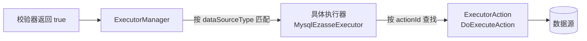

import Tabs from '@theme/Tabs';
import TabItem from '@theme/TabItem';

# 执行器

执行器（`EzasseExecutor`）是 ezasse 中负责**与数据源直接交互**的组件。当校验器判定条件满足需要执行时，ezasse 会从 `ExecutorManager` 中根据数据源类型（如 `MYSQL`、`ORACLE`）找到对应的执行器，并通过 **Action（动作）** 机制来完成具体的 SQL 执行操作。

## 工作原理



执行器与校验器职责分离：**校验器判断是否执行，执行器决定如何执行**。执行器本身不含业务逻辑，全部通过可扩展的 Action 机制来实现。

## 内置执行器

`ezasse-for-jdbc` 模块提供以下针对关系型数据库的内置执行器：

| 执行器类 | 数据源类型标识 | 适用数据库 |
|---|---|---|
| `MysqlEzasseExecutor` | `MYSQL` | MySQL |
| `MariaDbEzasseExecutor` | `MARIADB` | MariaDB |
| `OracleEzasseExecutor` | `ORACLE` | Oracle |
| `H2EzasseExecutor` | `H2` | H2（常用于测试） |
| `HsqlDbExecutor` | `HSQLDB` | HyperSQL Database |

:::tip
在 Spring Boot 环境下，ezasse 会根据 `spring.datasource.url` 自动识别数据库类型并选择对应执行器，无需额外配置。
:::

## EzasseExecutor 接口说明

所有执行器都继承自抽象类 `cn.com.pism.ezasse.model.EzasseExecutor`：

```java
public abstract class EzasseExecutor {

    /**
     * 执行指定的 Action
     *
     * @param actionId   动作 ID（内置常量见 EzasseExecutorActionConstants）
     * @param param      动作所需的参数对象
     * @param dataSource 当前使用的数据源
     * @return 执行结果（类型由 Action 泛型决定）
     */
    public <R, P extends ActionParam> R execute(String actionId, P param, EzasseDataSource dataSource) { ... }

    /**
     * 返回该执行器支持的数据源类型标识，必须唯一
     * 该值应与 EzasseDataSource.getType() 的返回值一致才能匹配
     * 例如：return "MYSQL";
     */
    public abstract String getDataSourceType();
}
```

## ExecutorAction 机制详解

执行器本身不含业务逻辑，全部通过 **Action** 来实现。每个 Action 对应一个 `actionId`，聚合所有同类型操作：

| Action 常量 | 说明 | 适用场景 |
|---|---|---|
| `DO_EXECUTE` | 执行 SQL 脚本（写操作） | 校验通过后的最终执行 |
| `DEFAULT_CHECK` | 执行校验 SQL，返回值为 0 时通过 | EXEC 校验器 |
| `TABLE_EXISTS` | 检查表是否存在 | TABLE 校验器 |
| `GET_TABLE_INFO` | 获取表的结构信息 | TABLE/各 Field 校验器 |
| `GET_COLUMN_INFO` | 获取列的详细信息（类型、长度、注释） | ADD/CHANGE_* 校验器 |

Action 与执行器解耦，意味着**同一个 Action 可以在多个执行器间共享，新的 Action 无需修改已有执行器**。

## 自定义执行器（完整流程）

以下以对接 **ClickHouse** 为例，展示完整的自定义执行器开发流程。

### 第一步：实现执行器类

继承 `EzasseExecutor`，声明支持的数据源类型：

```java
package com.example.ezasse.executor;

import cn.com.pism.ezasse.model.EzasseExecutor;

/**
 * 自定义执行器：适配 ClickHouse 数据库
 */
public class ClickHouseEzasseExecutor extends EzasseExecutor {

    @Override
    public String getDataSourceType() {
        // 必须与 EzasseDataSource.getType() 返回值一致
        return "CLICKHOUSE";
    }
}
```

### 第二步：实现 ExecutorAction

为执行器实现具体操作逻辑：

```java
package com.example.ezasse.executor.action;

import cn.com.pism.ezasse.model.DoExecuteActionParam;
import cn.com.pism.ezasse.model.EzasseDataSource;
import cn.com.pism.ezasse.model.EzasseExecutorAction;

import static cn.com.pism.ezasse.constants.EzasseExecutorActionConstants.DO_EXECUTE;

/**
 * ClickHouse 执行 SQL 的 Action
 */
public class ClickHouseDoExecuteAction
        implements EzasseExecutorAction<DoExecuteActionParam, Void> {

    @Override
    public String getActionId() {
        return DO_EXECUTE; // 使用内置常量 "DO_EXECUTE"
    }

    @Override
    public String getDataSourceType() {
        return "CLICKHOUSE";
    }

    @Override
    public Void doAction(DoExecuteActionParam param, EzasseDataSource dataSource) {
        // 从 EzasseDataSource 获取底层 ClickHouse DataSource
        javax.sql.DataSource ds = dataSource.getDataSource();
        String sql = param.getCheckLineContent().getExecuteScript();

        // 执行 SQL（此处为示意，实际使用 ClickHouse JDBC 驱动）
        try (var conn = ds.getConnection();
             var stmt = conn.createStatement()) {
            stmt.execute(sql);
        } catch (Exception e) {
            throw new RuntimeException("ClickHouse execute failed: " + e.getMessage(), e);
        }
        return null;
    }
}
```

### 第三步：实现 ActionRegister（推荐）

将所有 Action 的注册逻辑集中在一个 Register 中，便于管理：

```java
package com.example.ezasse.executor;

import cn.com.pism.ezasse.model.ExecutorActionRegister;
import cn.com.pism.ezasse.manager.ExecutorManager;
import com.example.ezasse.executor.action.ClickHouseDoExecuteAction;
import com.example.ezasse.executor.action.ClickHouseCheckAction;

/**
 * ClickHouse 执行器 Action 注册器
 */
public class ClickHouseExecutorActionRegister implements ExecutorActionRegister {

    @Override
    public void registry(ExecutorManager executorManager) {
        // 注册执行 Action
        executorManager.registerExecutorAction("CLICKHOUSE", new ClickHouseDoExecuteAction());
        // 注册校验 Action（如果需要支持 EXEC 校验器）
        executorManager.registerExecutorAction("CLICKHOUSE", new ClickHouseCheckAction());
    }
}
```

### 第四步：注册执行器与 ActionRegister

<Tabs groupId="register-method">
  <TabItem value="spi" label="SPI（推荐，适用所有项目）">

创建以下两个 SPI 文件：

**文件1：** `src/main/resources/META-INF/services/cn.com.pism.ezasse.model.EzasseExecutor`
```
com.example.ezasse.executor.ClickHouseEzasseExecutor
```

**文件2：** `src/main/resources/META-INF/services/cn.com.pism.ezasse.model.ExecutorActionRegister`
```
com.example.ezasse.executor.ClickHouseExecutorActionRegister
```

  </TabItem>
  <TabItem value="spring" label="Spring Bean（Spring Boot 项目）">

```java
import org.springframework.context.annotation.Bean;
import org.springframework.context.annotation.Configuration;

@Configuration
public class EzasseClickHouseConfig {

    @Bean
    public ClickHouseEzasseExecutor clickHouseEzasseExecutor() {
        return new ClickHouseEzasseExecutor();
    }

    @Bean
    public ClickHouseExecutorActionRegister clickHouseExecutorActionRegister() {
        return new ClickHouseExecutorActionRegister();
    }
}
```

  </TabItem>
  <TabItem value="manual" label="手动注册（编程式）">

```java
FileEzasse ezasse = new FileEzasse();
ExecutorManager executorManager = ezasse.getContext().executorManager();

// 注册执行器
ClickHouseEzasseExecutor executor = new ClickHouseEzasseExecutor();
executor.setExecutorManager(executorManager);
executorManager.registerExecutor("CLICKHOUSE", executor);

// 注册 Action
executorManager.registerExecutorAction("CLICKHOUSE", new ClickHouseDoExecuteAction());

ezasse.execute();
```

  </TabItem>
</Tabs>

### 第五步：配置 ClickHouse 数据源

实现 `EzasseDataSource`（详见 [数据源](./datasource)），将 `getType()` 返回值设置为 `"CLICKHOUSE"` 以与执行器匹配：

```java
public class ClickHouseEzasseDataSource implements EzasseDataSource {
    // ...
    @Override
    public String getType() {
        return "CLICKHOUSE"; // 与执行器 getDataSourceType() 一致
    }
}
```

## 注意事项

:::caution
- `getDataSourceType()` 返回的标识符必须与 `EzasseDataSource.getType()` 完全一致（大小写敏感），否则无法匹配。
- 若 Action 未注册，`executor.execute()` 会返回 `null` 并记录 trace 日志，不抛出异常。如需强制校验，需自行判断返回值。
:::

:::tip
JDBC 系数据库（MySQL、Oracle、H2 等）推荐直接使用 `ezasse-for-jdbc` 中的内置执行器，无需重复实现基础 Action。
:::