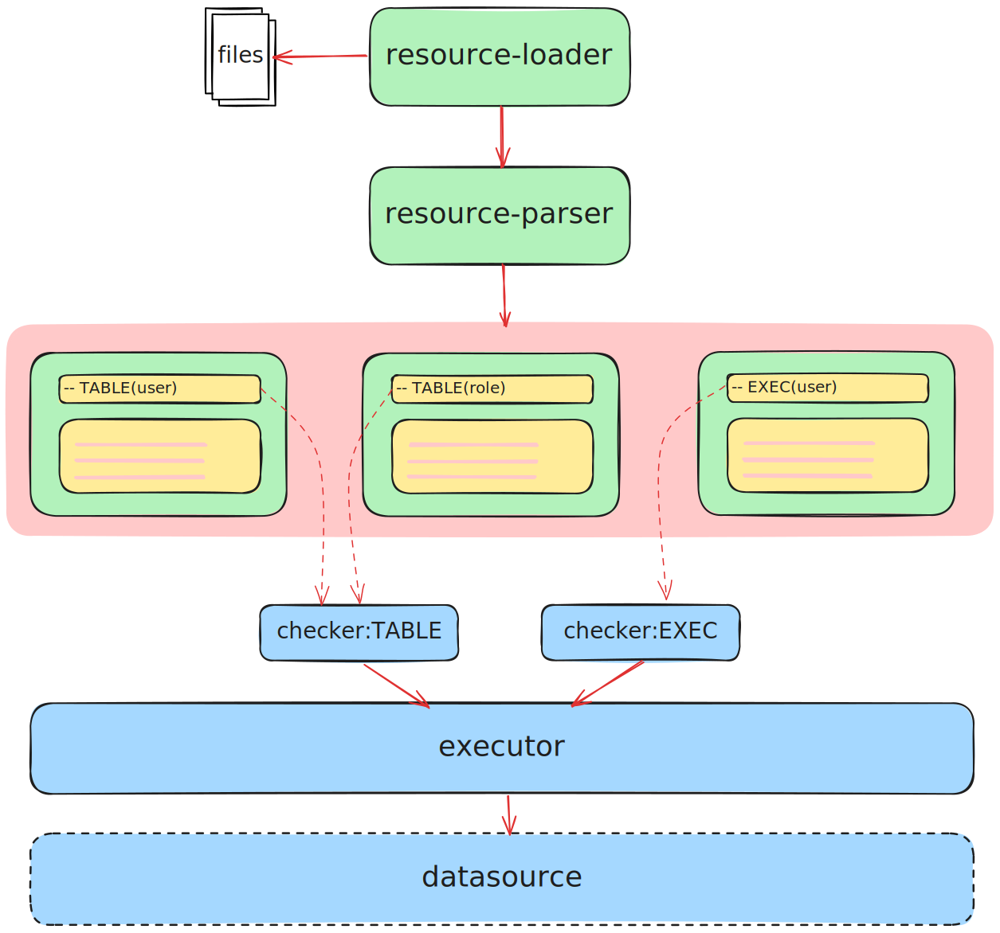
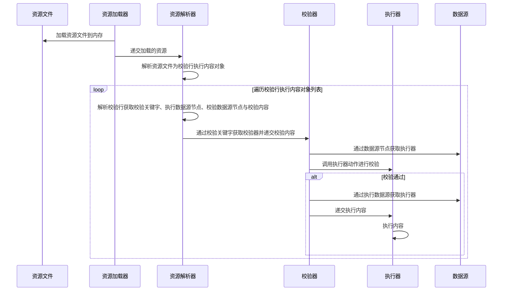

# 开始之前

在开始使用ezasse之前需要对ezasse进行简单了解

## 原理

Ezasse 通过**资源加载器**对所有文件进行扫描，在获取到文件之后，利用**资源解析器**将其解析为**资源对象**
。接着，它会遍历这些资源文件，逐行实施校验操作。在校验过程中，依据校验行来获取对应的**校验器**
，进而对校验行中的校验内容进行校验。一旦校验通过，相关内容就会被传递给**执行器**，由**执行器**执行相应的操作。

### 示意图



### 时序图



## 术语

### 校验行

校验行 主要由 校验关键字 和 校验语句 组成，并且可以指定校验节点和执行节点

校验节点和数据节点分别为数据节点

#### 语法

:::tip 语法
`-- 关键字[.校验节点][.执行节点](校验内容)`
:::

#### 示例

```SQL
-- 当数据库中不存在表user，执行执行内容
-- TABLE(user)
```

##### 关键字

***必要***
关键字对应着不同的校验功能，使用不同的校验关键字，会选取不同的校验器

##### 校验节点

***可选的***
校验节点为数据源名称，如果指定了校验节点，校验内容会在该节点中执行，如果只指定了校验节点，校验内容与执行内容都在该节点中执行

##### 执行节点

***可选的***
执行节点为数据源名称，要先有校验节点，执行节点才生效，指定了执行节点，执行内容在指定的执行节点中执行

##### 校验内容

***必要***
校验内容按照关键字规则进行添加一般格式类似于`(xxx.xxx.xxx)`，不同的校验关键字，校验内容编写规则也有所不同

### 执行内容

执行内容也是***可选的***，执行内容的范围为校验行到校验行直接的内容，如果指定了开始限定符和结束限定符，执行内容就只包含限定符区间的内容

#### 语法

:::tip 语法
> 开启限定符配置 `-- [`,`-- ]`

```SQL showLineNumbers
-- TABLE(user)
-- [
CREATE TABLE user
(
    id   BIGINT NOT NULL COMMENT '主键id'
        PRIMARY KEY,
    name VARCHAR(1024) NULL COMMENT '账号'
) COMMENT '用户表';
-- ]
```

:::